# 🌾 Agricultural Workforce Optimization System (AWOS)

> A full-stack Django-based workforce management platform tailored to optimize agricultural labor assignment, task tracking, and payment processing for farmers and workers.

---

## 🚀 Overview

The **Agricultural Workforce Optimization System** streamlines how agricultural workers and service requests are managed. It acts as a centralized platform where:

- **Admins** manage tasks, users, payments, and schedules
- **Customers (Farm Owners)** can post job requests and view progress
- **Workers** get assigned tasks based on skill, availability, and proximity

This system ensures efficient labor use, fair worker compensation, seamless communication, and reliable service delivery — all crucial for modern, scalable agriculture.

---

## 👥 Roles & Features

### 🛠 Admin Panel
- Create and manage worker/customer accounts
- Assign tasks based on skill & availability
- Track task status in real time
- View all tasks, progress reports, payments

### 👨‍🌾 Customer Portal
- Register and post service requests (day-to-day, seasonal, misc.)
- Track job progress and communicate with assigned workers
- Receive invoices and make secure payments
- Provide feedback & ratings

### 👷 Worker Dashboard
- Register and list skills & availability
- Receive and manage assigned tasks
- Log work hours and task status
- View compensation records

---

## 🧠 Key Modules

- 🔄 **Task Assignment Engine**: Matches workers to jobs using skills, location, and availability
- 💰 **Payment & Invoice System**: Advance payments, milestone tracking, and final settlements
- 📊 **Progress Monitoring**: Real-time status updates, GPS tracking, and customer check-ins
- 🛡️ **Worker Verification & Strike Policy**: 5-strike rule for cancellation handling
- 🚚 **Logistics Coordination**: Equipment provisioning and worker transportation
- 📈 **Feedback & Improvement Loop**: Worker ratings feed into task matching

---

## 🏗️ Tech Stack

| Layer        | Tech Stack                         |
|--------------|------------------------------------|
| Backend      | Django (Python), Django REST       |
| Frontend     | HTML, CSS, JavaScript              |
| Database     | SQLite (development), PostgreSQL   |
| Deployment   | (Optional: Render, Railway, Heroku)|
| Versioning   | Git, GitHub                        |

---

## 📸 Screens


## 📸 Screenshots

### 🟢 Home Page
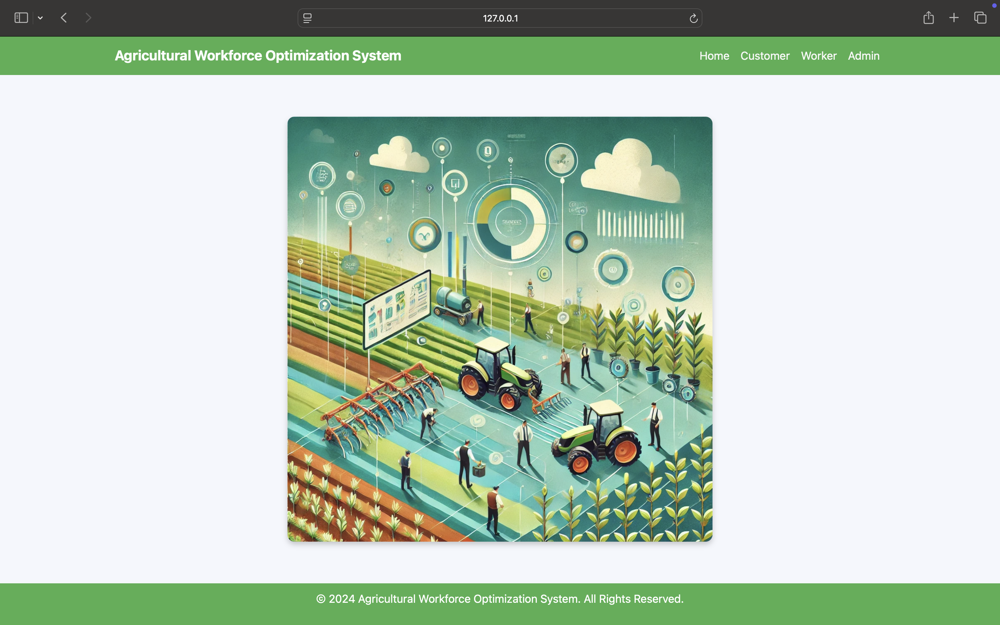

### 🟢 Admin Login
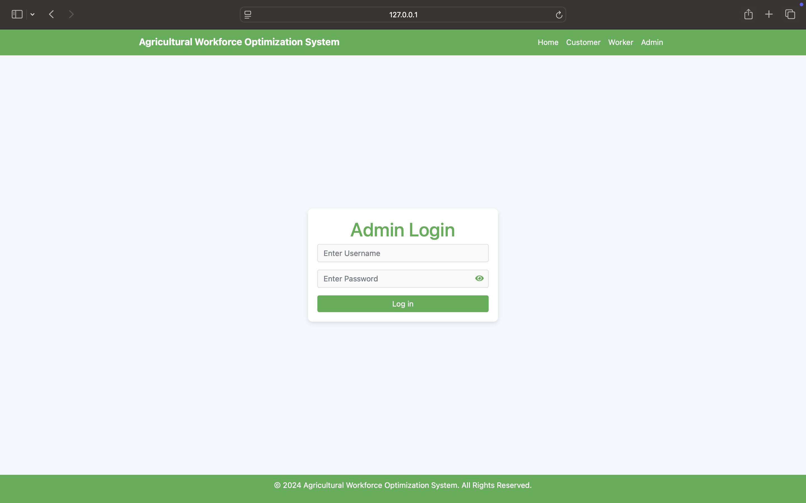

### 🟢 Admin Dashboard
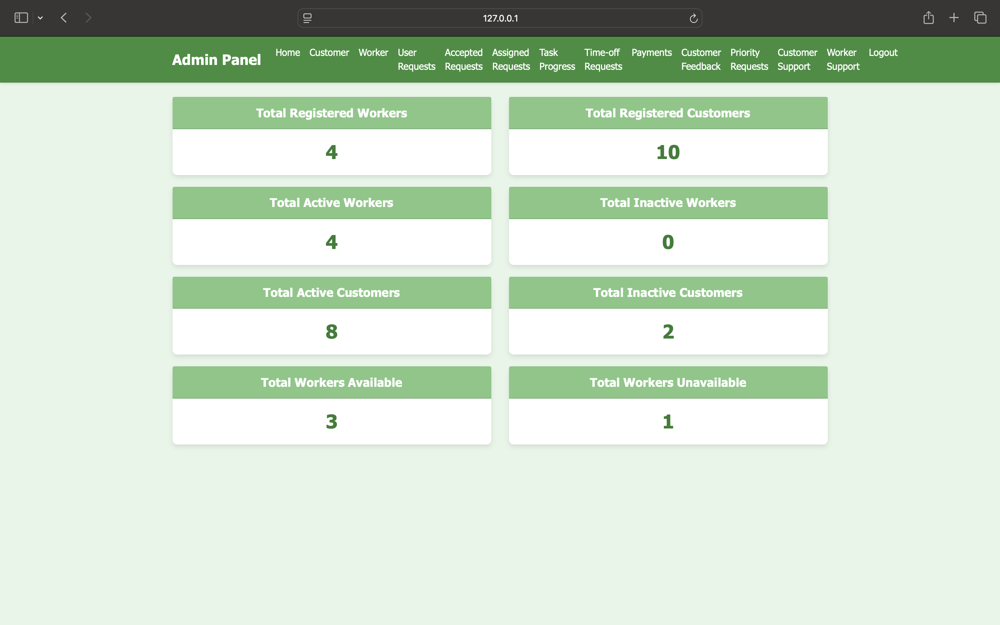

### 🟢 Assigned Tasks


### 🟢 Create Service Request
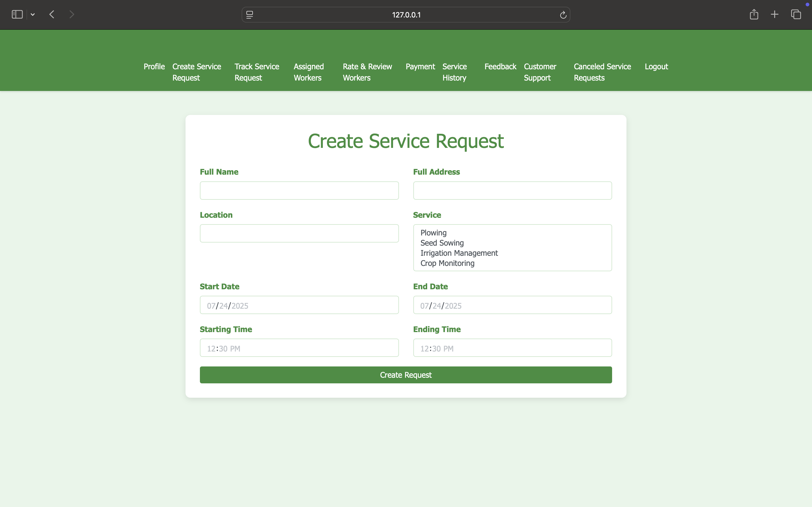

### 🟢 Customer Login
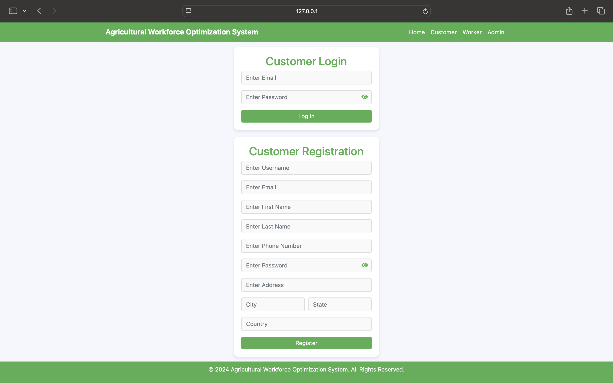

### 🟢 Customer Profile
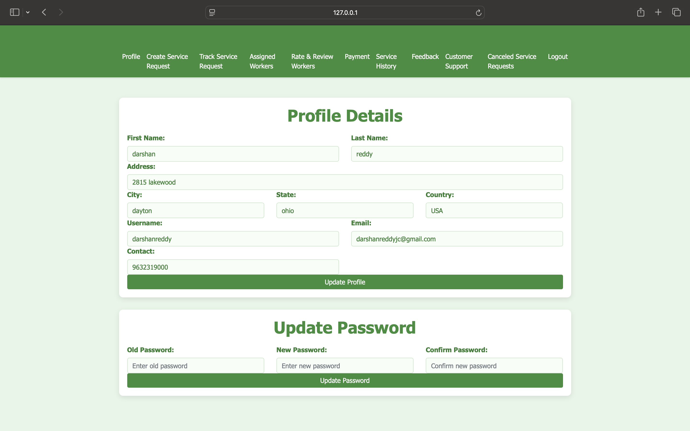

### 🟢 Customer Support
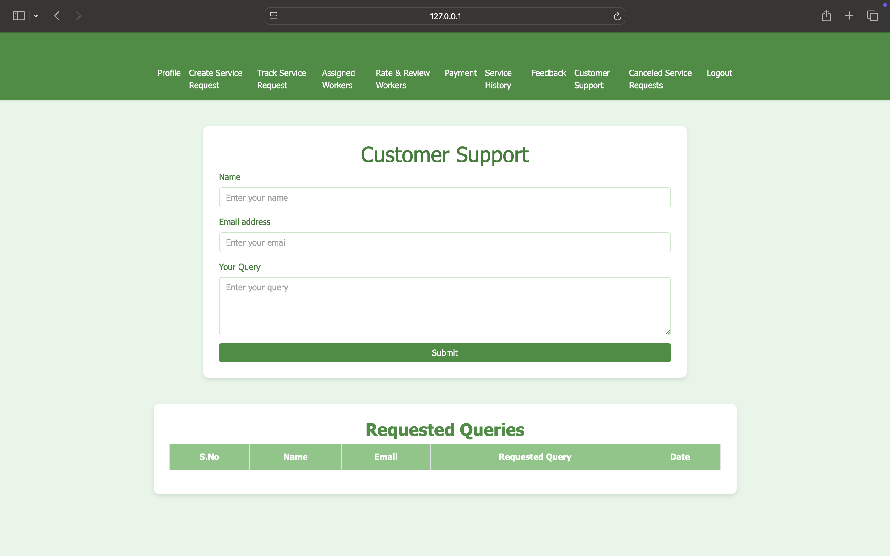

### 🟢 Rate and Review
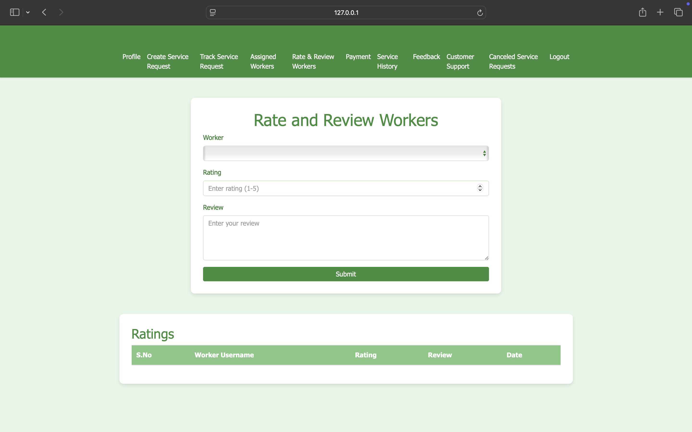

### 🟢 Registered Customers
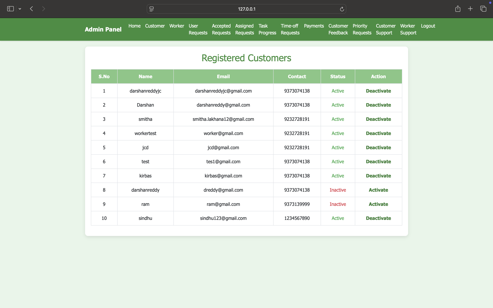

### 🟢 Requested Services
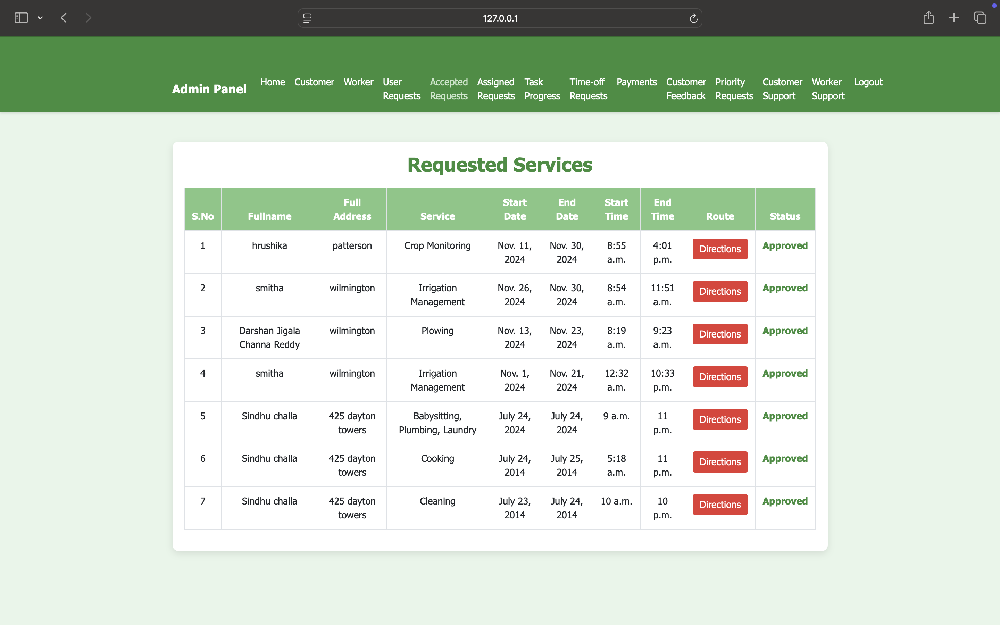

### 🟢 Task Progress
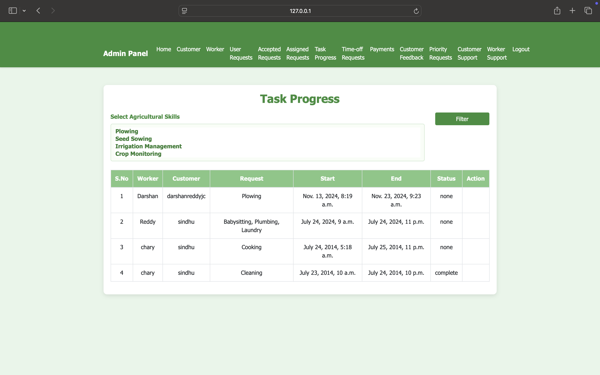

### 🟢 Worker Login
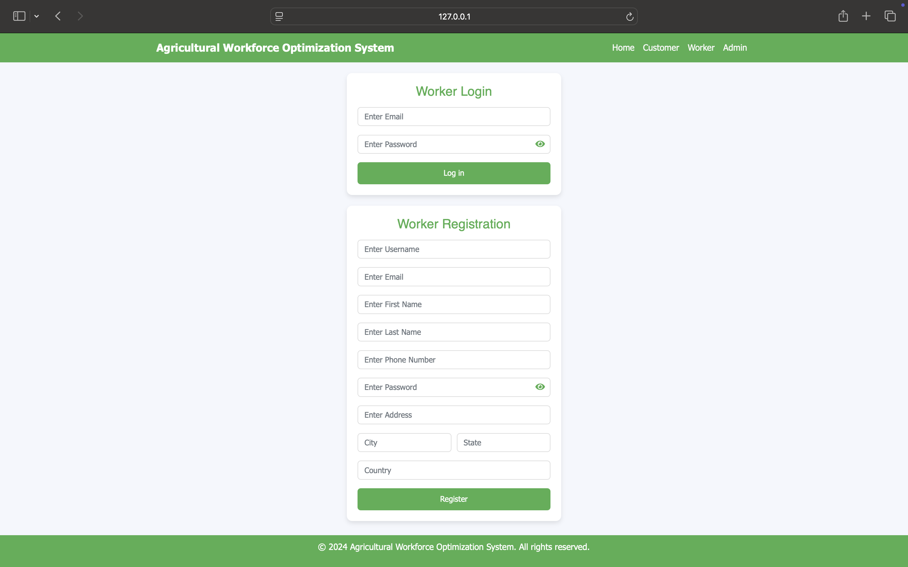

### 🟢 Worker Status
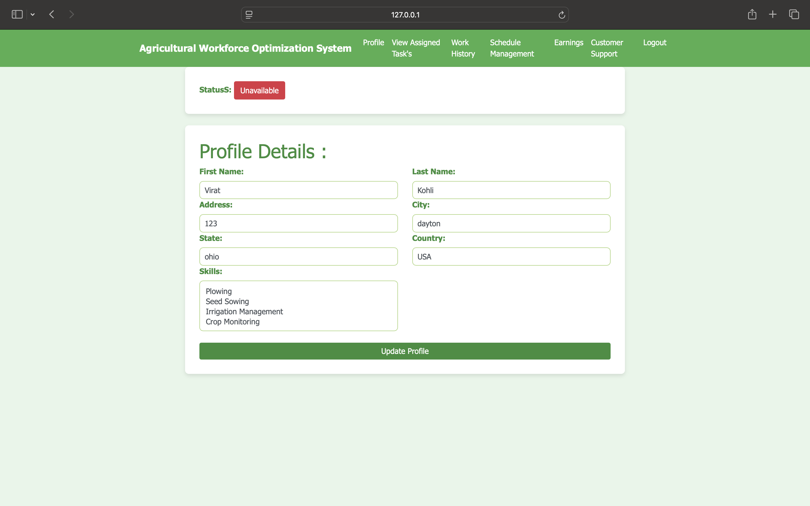

## ⚙️ Setup Instructions

### 🔧 1. Clone the Repo
```
bash
git clone https://github.com/your-username/agri-workforce-optimizer.git
cd agri-workforce-optimizer
🐍 2. Create Virtual Environment
bash
Copy
Edit
python -m venv venv
source venv/bin/activate  # on Windows: venv\Scripts\activate
📦 3. Install Dependencies
bash
Copy
Edit
pip install -r requirements.txt
🛠 4. Apply Migrations & Create Superuser
bash
Copy
Edit
python manage.py migrate
python manage.py createsuperuser
▶️ 5. Run the Server
bash
Copy
Edit
python manage.py runserver
Visit http://127.0.0.1:8000/ to explore the platform.
```

📂 Project Structure

agri_workforce/
│
├── customer/         # Customer-side logic and views
├── worker/           # Worker registration, profiles, task management
├── adminpanel/       # Admin dashboard features (assign tasks, view all tasks)
├── templates/        # HTML templates for UI rendering
├── static/           # CSS, JS, and images
├── models.py         # All database models
├── views.py          # Business logic handlers
└── urls.py           # Routing and navigation


📄 Documentation
📘 Use Cases: Customer Handling, Worker Management, Task Assignment, View All Tasks

🗂️ Diagrams: Use Case, Activity, Sequence, ER, Class, and Deployment Diagrams

🧪 Test Reports: Functional testing logs and scenario validation (included in docs folder)

📖 User Guide: Available in /docs/UserGuide.pdf

🧾 License
This project was created as part of the 518 Software Engineering course at the University of Dayton. Contact authors for academic or commercial use permissions.


📽️ Demo Video
👉 Watch the Demo Video

✅ Status
✅ Admin Dashboard complete

✅ Customer & Worker portals implemented

✅ Task assignment, invoice, and progress tracking functional

✅ Full system tested and deployed locally

💬 Feel free to fork, contribute, or reach out for collaboration opportunities!
